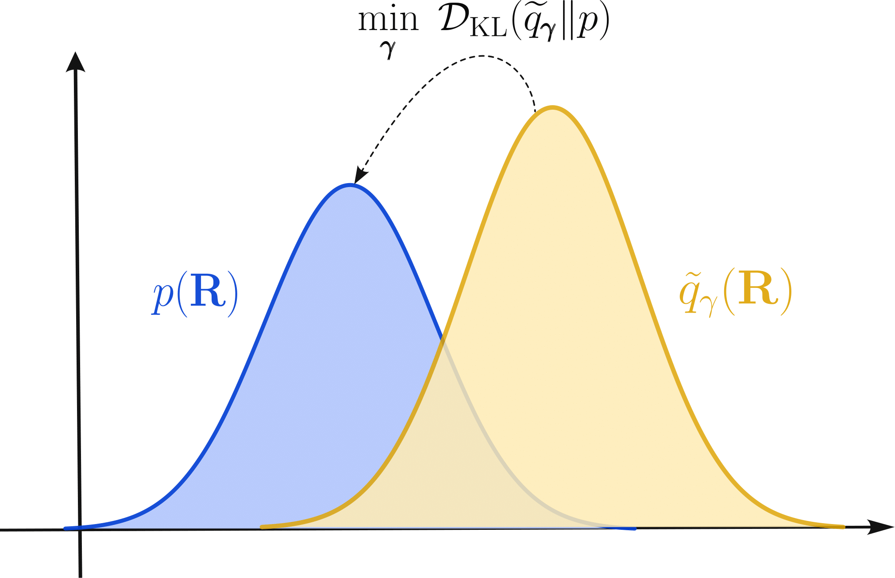
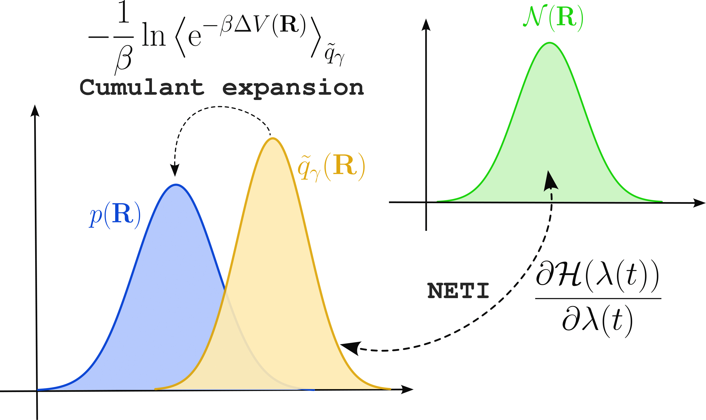
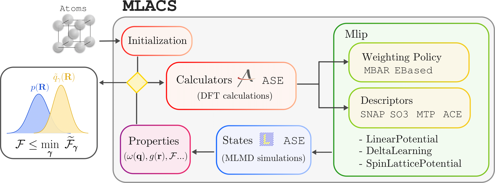

.. _background:
.. index:: Background

Background
##########

Considering an arbitrary system of :math:`N_\mathrm{at}` atoms at a temperature :math:`T`, and subject to a potential :math:`V(\mathbf{R})`, the classical average of an observable :math:`O(\mathbf{R})` is written

.. math::
   \langle O(\mathbf{R}) \rangle = \int d \mathbf{R}  O(\mathbf{R}) p(\mathbf{R}) \approx \sum_n w_n O(\mathbf{R}_n)

where :math:`p(\mathbf{R}) = e^{-\beta V(\mathbf{R})}/\mathcal{Z}` is the Boltzmann weight, with :math:`\mathcal{Z}=\int e^{-\beta V(\mathbf{R})}` the partition function and :math:`w_i` is the weight of configuration :math:`i` in the approximation involving a limited number of sample.

In the context of *ab initio* simulations, obtaining the canonical distribution :math:`p(\mathbf{R})` entails costly *Ab Initio* Molecular Dynamics (AIMD), which can be challenging to perform or even beyond reach.

The goal of the Machine-Learning Assisted Canonical Sampling approach is to produce a reduced set of configurations and their associated weight using a Machine-Learning Interatomic Potential (MLIP) in order to approximate the canonical distribution and allow the computation of finite-temperature property in an *ab initio* setting.

Theory
******

Machine-Learning Assisted Canonical Sampling
--------------------------------------------

MLACS is built upon the Kullback-Leibler divergence, whose goal is to give a measure of the discrepancy between two distribution :math:`p(\mathbf{R})` and :math:`\widetilde{q}_\gamma(\mathbf{R})` and is written

.. math::
   \mathcal{D}_{KL}(\widetilde{q}_\gamma \Vert p) = \int d\mathbf{R} \widetilde{q}_\gamma(\mathbf{R}) \ln\bigg(\frac{\widetilde{q}_\gamma(\mathbf{R})}{p(\mathbf{R})}\bigg) \geq 0

In our case, :math:`p(\mathbf{R})` is the Boltzmann weight while :math:`\widetilde{q}_\gamma(\mathbf{R}) = \frac{1}{\widetilde{\mathcal{Z}}} e^{-\beta \widetilde{V}_\gamma(\mathbf{R})}` is a surrogate distribution, associated with a MLIP giving a potential :math:`\widetilde{V}_\gamma(\mathbf{R})`.
An important feature of the surrogate potential is its parametrization, indicated by the subscript :math:`\gamma`, meaning that its shape can be modified by adjusting the parameter :math:`\boldsymbol{\gamma}`.

With some reorganization, the Kullback-Leibler divergence inequality can be reformulated in term of free energies known as the Gibbs-Bogoliubov inequality

.. math::
   \mathcal{F} \leq \widetilde{\mathcal{F}}_\gamma + \langle \mathcal{F} - \widetilde{\mathcal{F}}_\gamma \rangle_\gamma

where :math:`\mathcal{F} = -k_BT \ln(\mathcal{Z})` and :math:`\widetilde{\mathcal{F}}_\gamma = -k_BT \ln(\widetilde{\mathcal{Z}}_\gamma)` are the free energy associated with respectively the true and MLIP potential, and :math:`\langle \rangle_\gamma` indicate an average take with the surrogate potential :math:`\widetilde{V}_\gamma(\mathbf{R})`.

This inequality is at the foundation of the MLACS method.
It indicates that by minimizing its right hand side with respect to the parameters :math:`\boldsymbol{\gamma}` of the surrogate distribution, one can obtain an optimal approximation for the free energy of the system.
Moreover, due to the relation between the Gibbs-Bogoliubov inequality and the Kullback-Leibler divergence, this optimal free energy approximation also correspond to an optimal approximation of the canonical distribution of the system.
Thus, the goal of the MLACS approach is to perform this minimization.

We will assume a potential linearly related to the parameters, with a potential energy written :math:`\widetilde{V}_\gamma(\mathbf{R}) = \sum_n \gamma_n \widetilde{D}_n(\mathbf{R})`.
This correspond to class of widely used MLIP, the most known being SNAP, ACE or MTP.
For such potentials, the minima is obtained by a self-consistent least-squares

.. math::
   \boldsymbol{\gamma} = \langle \widetilde{D}_\gamma(\mathbf{R})^T \widetilde{D}_\gamma(\mathbf{R}) \rangle^{-1} \langle \widetilde{D}_\gamma(\mathbf{R})^T V(\mathbf{R}) \rangle_\gamma

The self consistency comes from the dependence of the optimal parameters to the average in the surrogate ensemble.

Free energy computation
-----------------------

As explained in the previous section MLACS allows to optimize an approximation for the free energy of the system.
However, the computation of this approximation necessitate to know the free energy associated with the surrogate model, which generally cannot be obtained analytically.
Fortunately, the surrogate free energy :math:`\widetilde{\mathcal{F}}_\gamma` can be computed numerically by means of Thermodynamic Integration (TI).

Let's introduce a reference system with a Hamiltonian :math:`H_\mathrm{ref}` for which the free energy :math:`\mathcal{F}_\mathrm{ref}` is known.
Then, one can build a parametrized Hamiltonaian :math:`H(\lambda) = \lambda \widetilde{H}_\gamma + (1 - \lambda)H_\mathrm{ref}` and it can be shown that the free energy difference :math:`\Delta \mathcal{F}_{\mathrm{ref}\rightarrow \gamma} = \widetilde{\mathcal{F}}_\gamma - \mathcal{F}_\mathrm{ref}` between the reference and surrogate potential is given by

.. math::
   \Delta \mathcal{F}_{\mathrm{ref}\rightarrow \gamma} = \int_0^1 d\lambda \bigg\langle \frac{\partial H(\lambda)}{\partial \lambda} \bigg\rangle_\lambda

where :math:`\langle \rangle_\lambda` correspond to an average with the Hamiltonian :math:`H(\lambda)`.
Using Jarzinsky's identity, it can be shown that this integral can be computed using the irreversible work generated during a non-equilibrium simulation starting from one state and ending in the other.
The irreversible work is written

.. math::
   W_{\mathrm{irr}} = \lim_{t_s\rightarrow \infty}\int_0^{t_s} dt \frac{\partial\lambda(t)}{\partial t} \frac{\partial H(\lambda)}{\partial \lambda}

Numerically, the effect of noise in the estimation of the free energy difference can be estimated by computing the average between forward and backward simulation between the reference and surrogate Hamiltonian as

.. math::
   \Delta \mathcal{F}_{\mathrm{ref}\rightarrow \gamma} = \frac{1}{2} \big( W_{\mathrm{irr}}^{\gamma\rightarrow \mathrm{ref}} - W_{\mathrm{irr}}^{\mathrm{ref}\rightarrow\gamma})

Then, the free energy associated with the surrogate model is given by

.. math::
   \widetilde{\mathcal{F}}_\gamma = \mathcal{F}_{\mathrm{ref}} + \Delta \mathcal{F}_{\mathrm{ref}\rightarrow \gamma}

However, we are interested in the free energy computed at the *ab initio* level.
Despite the great accuracy provided by MLIPs, remaining at this level can generate error that are too large compared to the precision needed in free energy calculation.
Thus, it can be important to perform another step consisting in correcting the obtained free energy from the surrogate model to *ab initio*.

From free energy perturbation theory, we know that the difference :math:`\Delta \mathcal{F}_{\gamma\rightarrow \mathrm{AI}} = \mathcal{F} - \widetilde{\mathcal{F}}_\gamma` between *ab initio* and the surrogate model is written

.. math::
   \Delta \mathcal{F}_{\gamma\rightarrow \mathrm{AI}} = \big\langle e^{-\beta \Delta V(\mathbf{R})} \big\rangle_\gamma

with :math:`\Delta V(\mathbf{R}) = V(\mathbf{R}) - \widetilde{V}_\gamma(\mathbf{R})`.
This equation can be expanded into cumulants as

.. math::
    \Delta \mathcal{F}_{\gamma\rightarrow \mathrm{AI}} = \sum_{n=1}^\infty \frac{(-\beta)^{n-1} \kappa_n}{n!}

where :math:`\kappa_n` is the :math:`n` -th order cumulant of the potential energy difference.
Up to second order, the cumulants are given by

.. math::
   \kappa_1 =& \langle \Delta V(\mathbf{R}) \rangle_\gamma \\
   \kappa_2 =& \langle \Delta V^2(\mathbf{R}) \rangle_\gamma - \langle \Delta V(\mathbf{R}) \rangle_\gamma^2

Using this cumulant expansion, the free energy difference becomes

.. math::
    \Delta \mathcal{F}_{\gamma\rightarrow \mathrm{AI}} \approx \langle \Delta V(\mathbf{R}) \rangle_\gamma + \frac{\beta}{2} \langle \Delta V^2(\mathbf{R}) \rangle_\gamma - \langle \Delta V(\mathbf{R}) \rangle_\gamma^2

and the final expression for the free energy at the *ab initio* level is

.. math::
   \mathcal{F} = \mathcal{F}_{\mathrm{ref}} + \Delta \mathcal{F}_{\mathrm{ref}\rightarrow \gamma} + \Delta \mathcal{F}_{\gamma\rightarrow \mathrm{AI}}

 ab initio calculation (in blue)

Implementation
**************

